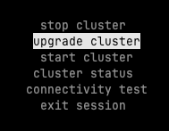
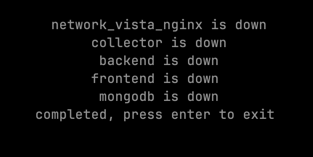
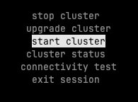
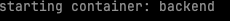
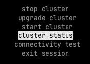
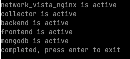

# Network Vista Overview

Network Vista is a network data collection and compliance platform. Users can:

* Collect Data: Gather information from network devices.
* Parse and Structure: Organize the collected data into a structured database.
* Query and Test: Execute queries and create tests against the stored data to ensure compliance and analyze network performance.

# Prerequisites

Please ensure that you have the following prerequisites and dependencies in place

* Python 3.10 (or higher): The project is built on Python, and it requires version 3.10 or higher to run successfully.
* Docker: Docker is required as part of this installation. 
* Git: Git is required to clone this repository.

# Installation Instructions

Note: these installation Instructions has only been tested against Linux Based platforms. 

Clone the repo
```bash
git clone https://github.com/atxit/network_vista.git
```

Go to the project folder
```bash
cd network_vista
```

Run setup.sh, this will:

* create a Python virtual environment in the root of the project.
* activate the virtual environment
* install all packages which are required to run this project

```bash
. setup.sh
```

Run python setup.py file, this will:

* generate default system passwords which will be used by Network Vista.
* test connectivity to the docker hub.
* pull the mongo Docker image.
* enable a Mongo password on each database
* generate default SSL certs which are used by the NGINX container. 

System passwords are found in the system.yml file, these are generated during the setup process and are unique to each deployment.
The Network Vista Root password is found within system.yml. 
If you wish to change the root password, simply update the root password and save the file. If the cluster is operationally, please restart it. 

```bash
python3 setup.py
```

Run python cluster_controller.py, this will start the controller UI. Within the controller UI, you can:

* start the cluster. 
* stop the cluster.
* check the status of the cluster.
* import the Network Vista core images or update the existing images.
* test connectivity to the Docker Hub.

```bash
python3 cluster_controller.py
```

Step One: Pull Core Images

Note: During the first installation, the cluster controller will pull the Network Vista core image. As these core images are fairly large, please be patient.



Step Two: Check the Cluster Status, all containers should be displaying down.



Step Three: Start the Cluster





Step Four: Check Cluster Status






Click https://127.0.0.1 to access Network Vista.

Once you have access, checkout my YouTube Channel https://www.youtube.com/channel/UCBLGibrwjedh2GW4nrF8bzQon how to navigate the Network Vista or review the "how to" guides which are found within the howTo directory (located within this repository)


