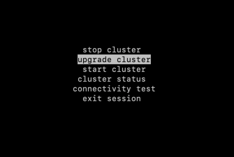
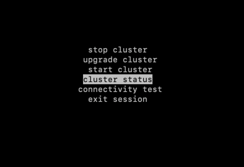
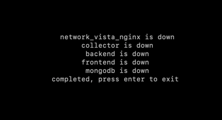
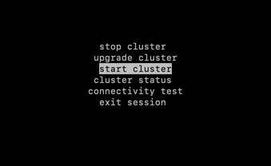
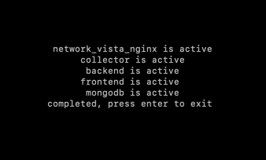
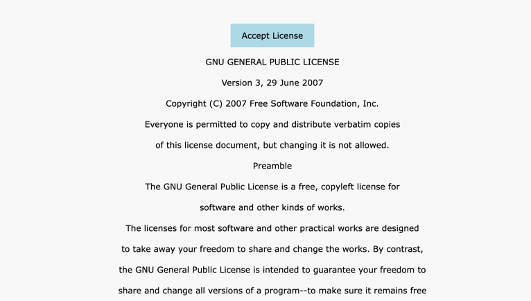
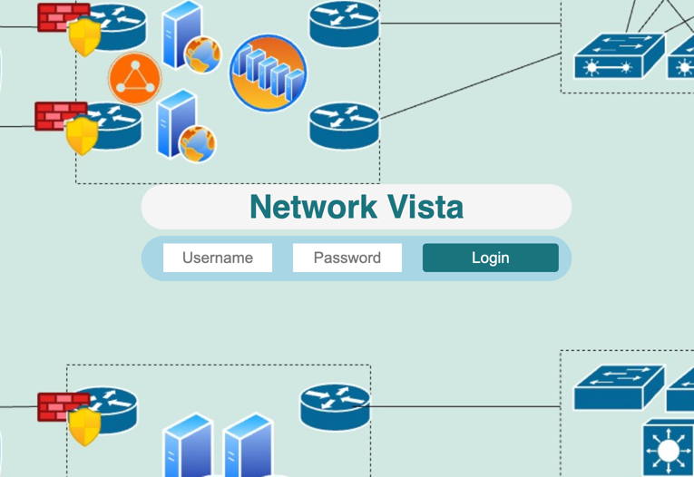

# Network Vista (beta 0.9)

Introducing Network Vista, a comprehensive platform designed to streamline network data collection and ensure compliance. The Network Vista platform offers a holistic view of your network.

* Define Database Structures: Easily set up database tables tailored to your network's needs.
* Track change: Effortlessly monitor and record modifications within your tables, providing clear insights into what changed and when.
* Automate Data Population: Specify 'show' commands to automatically populate tables with relevant data.
* Utilise Advanced Parsing: Leverage SSH for secure device communication and employ NTC Templates for efficient data parsing or utilise the inbuilt 'build your own Parser' module (PPT).
* Integrate Custom Meraki Platform Parsers: Seamlessly incorporate bespoke parsers for Cisco Meraki devices, ensuring accurate data collection and analysis.
* Track Configuration Changes: Maintain a comprehensive record of changes within any table, facilitating effective change management.
* Implement Custom Tests: Create user-defined tests within tables to ensure compliance and monitor network performance.
* Support Configuration Auditing: Conduct thorough configuration audits for both SSH-enabled devices and Cisco Meraki platforms, enhancing network security and compliance.
* API Support for All user defined tables: Access all table data via robust API integration, enabling seamless integration with other systems and enhancing automation capabilities.
* Support LDAP Integration: Integrate with Lightweight Directory Access Protocol (LDAP) servers to centralize authentication and streamline user management.
* Implement Role-Based Access Control (RBAC): Define and enforce user roles and permissions to ensure secure and appropriate access to Network Vista resources.

With Network Vista, gain unparalleled insights into your network's data, ensuring both efficiency and compliance.

### Prerequisites

Please ensure that you have the following prerequisites and dependencies in place

* Python 3.10 (or higher): The project is built on Python, and it requires version 3.10 or higher to run successfully.
* Docker: Docker is required as part of this installation. 
* Git: Git is required to clone this repository.

### Installation Instructions

Note: these installation Instructions has only been tested against Linux Based platforms. 

Clone this repository
```bash
git clone https://github.com/atxit/network_vista.git
```

Go to the project folder
```bash
cd network_vista
```

Run setup.sh, this will:

* create a Python virtual environment in the root of the project.
* activate the virtual environment
* install all packages which are required to run this project

```bash
. setup.sh
```
<i>
techTip to MacUsers

Due to an additional layer of security, Mac users must grant access to the ~/data/db directory, this can be done by using the Docker desktop App.
</i>


Run python setup.py file, this will:

* generated system default passwords which includes the root access password<i>(found in the system.yml file, located in the project root</i>
* create a default location for the Mongo Databases (~/data/db).
* test connectivity to the docker hub.
* pull the Mongo Docker image.
* enable a Mongo password on each database
* generate default SSL certs which are stored in ~/network_vista_certs/ and used by the NGINX container. 

<i>
techTip: during the setup process, a docker permission error may be displayed. If seen, try using the following command to 
resolve the permission issue. 
</i>

```bash
sudo chown $(whoami):$(whoami) /var/run/docker.sock
```

System passwords are found in the system.yml file, these are generated during the setup process and are unique to each deployment.
The Network Vista Root password is found within system.yml. 
If you wish to change the root password, simply update the root password and save the file. If the cluster is operationally, please restart it. 

If you wish to change the system generated SSL certs:

* shutdown the cluster.
* remove the existing certs.
* replace the SSL certs. 
* rename the new public cert and private key using the following: network_vista_private_key.pem & network_vista_public_cert.pem
* restart the cluster.

```bash
python3 setup.py
```

Run python cluster_controller.py, this will start the controller UI. Within the controller UI, you can:

* start the cluster. 
* stop the cluster.
* check the status of the cluster.
* import the Network Vista core images or update the existing images.
* test connectivity to the Docker Hub.

```bash
python3 cluster_controller.py
```

1) Pull Core Images

Note: During the first installation, the cluster controller will pull the Network Vista core image. As these core images are fairly large, please be patient.



2) Check the Cluster Status, all containers should be display down.





3) Start the Cluster



4) Check Cluster Status, all containers should be active. 



To stop the cluster, please select the Stop Cluster option.

Open a web browser, enter https://[ipOfHost], and accept the self-signed cert.
Lastly, accept the end user license and the Network Vista cluster is up and ready to go!. 



Network Vista Login



### Support with using Network Vista

For support on how to use Network Vista, please check out my YouTube Channel https://www.youtube.com/channel/UCBLGibrwjedh2GW4nrF8bzQ or 
review the user guides which are found within the user_guide directory, located within this repository
