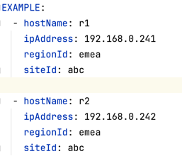

# Importing Devices into Network Vista

<i>techTip: Importing devices is permitted by root, admin and sudo admin users</i>

Before Network Vista can begin collecting and processing collected network data, the 
network device table must be populated. 
Importing devices into the Network Vista device Table can be done by either:

* uploading via a static .csv file (lab/demo); or 
* using the import device API (preferred option), these devices are known as dynamic within Network Vista

<i>techTip:
* devices which are uploaded to Network Vista via a .csv file are known as 'static'.
* devices which are uploaded to Network Vista via the API are known as 'dynamic'.
</i>

For instructions on how to upload using a static .csv, please refer to the settings.md
When using the API import method, each time the API uploads device data, all
dynamic devices will be removed. This way, any device which is no longer active/used will be automatically removed from the collection process.

<i>techTip: any static device found in the device table will take precedence over a dynamic device 
, Network Vista will reject the dynamic host which contains the duplicate hostnames. 
</i>
### Importing Devices using the API

<i>techTip: Network Vista does not self discover network devices. As such, a custom import device script will need to be created.</i>

Before starting, please a Read/Write Network Vista API key (refer to the setting.md for further instructions). Once the key is 
generated, navigate to the api directory. Next, open the 'device_example.yml' file:

The format of the JSON payload is a record, list of directories [{},{},{}]

device_example.yml:



When creating each dictionary (with the list), each key is mandatory. 

* Map the device hostname to the "hostName" key
* Map the device management IP to the "ipaAddress" key
* Map the device regional location to the "regionId" key
* Map the device site ID to the "siteId" key

<i>techTip: If the regional or site IDs are not known, enter a value of "unknown"
</i>
### Test API Connectivity

Navigate to the api directory, enter

-u url of Network Vista<br>
-t token, either readOnly or ReadWrite

```bash
python3 api_ping_test.py -u https://ipAddr_dnsName -t thisIsYourToken
```


<i>techTip: Only a readWrite token can upload devices to the device table</i> 
<br>

### Upload using Example

To upload devices using the device_example.yml example file:

* update the file with the correct details
* save the file

Navigate to the api directory, enter

-u url of Network Vista<br>
-t token, either readOnly or ReadWrite

```bash
python3 upload_devices.py -u https://ipAddr_dnsName -t thisIsYourToken
```


<i>techTip: r1 was rejected/removed from the update as it has been statically defined within Network Vista
</i>


