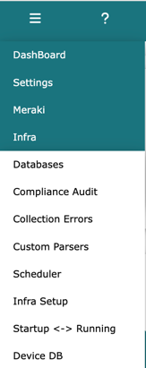
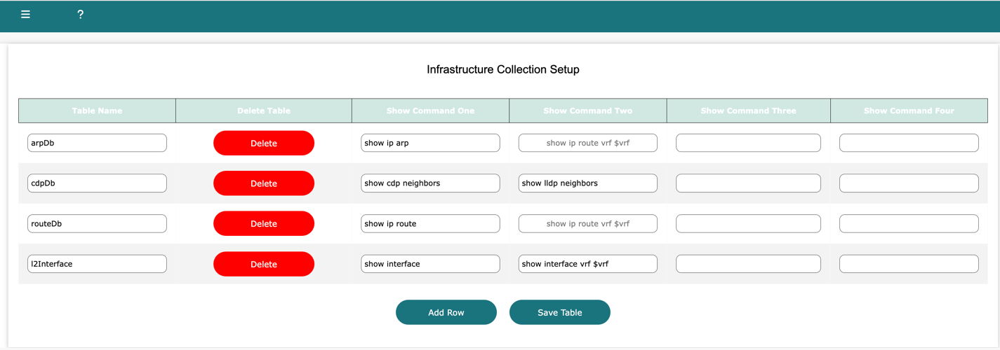
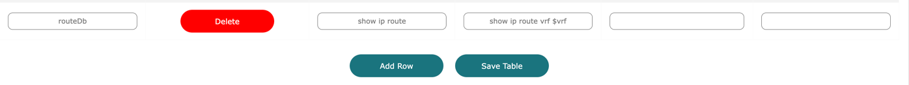
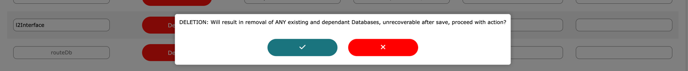
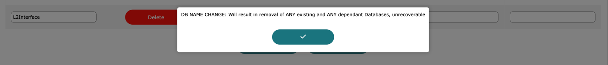

# Infra setup

<i>techTip: Infra Setup is only visible to root, admin and sudo admin users</i>

Log into Network Vista, open the menu (top left), select infra then **Infra Setup**

Use the Infra Setup module to enter show commands which are then used to create the table databases.
Each database requires a unique DB ID and can support up to four show commands. The show commands
must be parsable using NTC parsers; otherwise, the database will not be created.

In this example, there are four databases which have created. Since 'show cdp' and 'show lldp' are identical, these outputs 
can be combined.  For Cisco IOS devices which employ VRFs, use the **$vrf** instead of the VRF name. Network Vista 
will automatically resolve all device VRF's. 

To add a row, click **'Add Row'**

* Table Names should be unique and contain no special characters.
* Enter at least one NTC supported show command.

Once ready, click **'Save Table'**

To delete a Database, click **'Delete'**. This will remove the database and any dependant databases. 

Warning: this is unrecoverable once saved.

Warning: changing of database ID once a database has been created will result in the removal of that database and any dependant databases. 

<i>techTip: Changes to the Infra Setup table are only committed after the **Save Table** has been selected</i>

