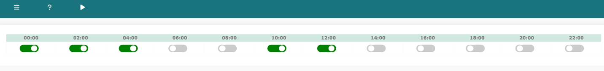
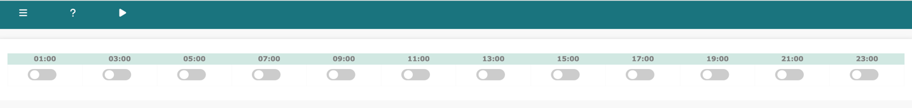

# Network Vista Scheduler

Log into Network Vista, open the menu (top left), select infra/scheduler for infra Scheduler.

Log into Network Vista, open the menu (top left), select meraki/scheduler for Meraki Scheduler.

<i>techTip: Scheduler is only visible as root, admin and sudo admin user</i>

Infra Scheduler

Collection can be scheduled every two hours starting at 12am UTC

Meraki Scheduler

Collection can be scheduled every two hours starting at 1am UTC

Both Infra and Meraki Scheduler support on-demand collections. Click the play arrow button next to the menu icon. 

<i>techTip: On-demand collection is only available if the scheduling process is idle</i>
<i>techTip: If the play arrow button is not visible, the scheduler is already running</i>

