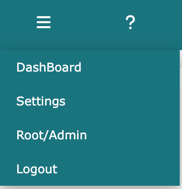
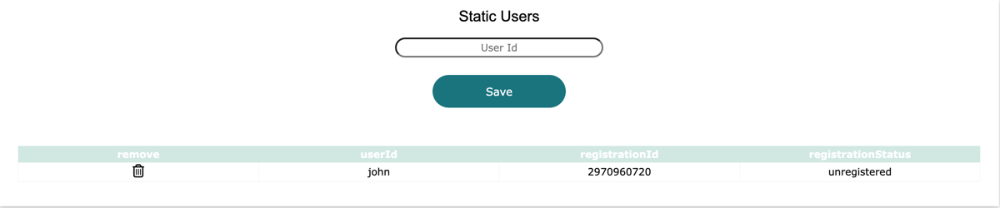
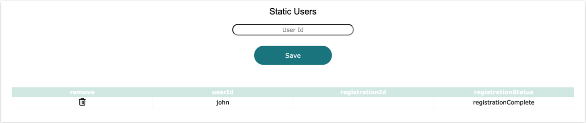
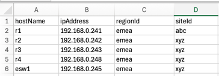
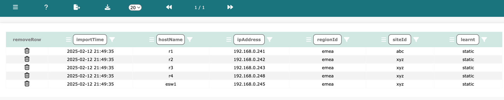
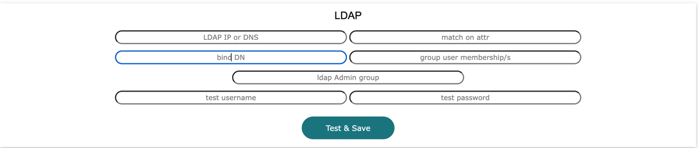

# Settings

Log into Network Vista, open the menu (top left), select settings:

<i>techTip: Settings is only visible to root, admin and sudo admin users</i>
#### System Administrator

In addition to the Network Vista root account, there is also an admin account. To enable the admin user account, please add a password. A minimum length of
Eight characters is required. Once ready, click Save.

#### Sudo Administrators

Sudo Admin Users are standard users which have elevated rights. Network Vista employees Roles Based Access Controls 
for certain functions (making changes). Add the users ID to one of the three input fields and click Save. 

#### Static Users

Static Users are accounts which can be created to access Network Vista. Static users are standard users unless elevated to Sudo Administrators. 
Add the user ID to the filed and select Save. 

<i>techTip: Network Vista supports LDAP integration, in addition to static users</i>

Please provide the 'registrationId' to the user and have then following the new user guide. Once registered, the 'registrationStatus' will change from 'unregistered' to 'registrationComplete' (the registrationCode will disappear) 

To remove a user, click the remove (trash) icon. 

#### Static Device Management

There are two methods to import devices into Network Vista: 

1) through the API, or;
2) upload using a .csv file

For a lab or a demo environment, using the static method would be the easiest approach.

To add a device or set of devices, click on the 'choose file' button. 

<i>techTip: The .csv file must contain the following columns:</i>

Once ready, click upload

To remove all static devices, click 'remove table'. 

To view the imported device table, navigate to the infra/device tab (once the infra menu has been activated)

#### Infrastructure SSH Access

To enable the SSH collection process, a username and password is required. The SSH password is encrypted by the vault seed password found in the system.yml file.  

Once ready, click 'Save Credentials'. 

<i>techTip: Read Only Password is recommended.</i>

<i>techTip: Once a SSH username and password has been saved, the infra menu will be activated.</i>

#### Concurrent VTY & SSH Sessions

Network Vista has been designed for rapid data collection. Use the 'Concurrent 
VTY Sessions' and 'Concurrent SSH Sessions' selection inputs to adjust the following options:

Concurrent VTY Sessions: 

number of active session PER Device

* One Vty Sessions
* Three Vty Sessions
* Five Vty Sessions

Concurrent SSH Sessions: 

the total number of concurrent collections

* 30 Device Sessions
* 60 Device Sessions
* 90 Device Sessions

#### Meraki API Key

To enable the Meraki collection process, please enter a valid Meraki key. Just like the SSH password, read only is recommended. 

Once ready, click 'Save and Test'. If successful, the Meraki menu will be activated. 
<i>techTip: If there is a Meraki organisation that should not be included, enter the organisation Id (numbers only)</i>

#### LDAP

To enable LDAP integration, please enter the following information:

* LDAP IP or DNS Name: The LDAP Server or VIP.
* Match on attr: The attribute to match on (ou for example).
* Bind DN: The location of the user search (uid=username,ou=users,dc=example,dc=org).
* Group user membership, when one or more groups are matched, access to Network Vista is granted.
* LDAP Admin Group, when matched, the user is grant admin access. 
* Test username and test password: runs a test using the provided information, if successful, LDAP is enabled across the platform. 

Click 'Test & Save'

#### Data Retention Policy

Defines the amount of time before stored logs messages will be removed. 

Diff Log Retention: 

* One Month
* Three Months
* Five Months

System Log Retention:

* One Month
* Two Months
* Three Months
* Four Months
* Five Months

