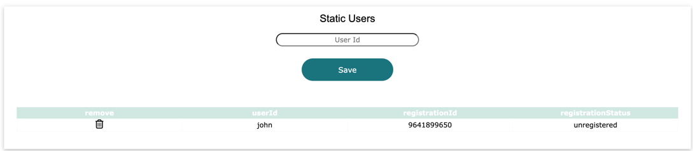
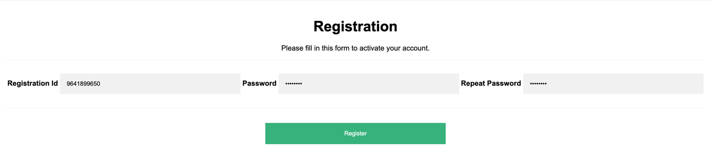

# Complete Static User Registration

Once a network admin has added a new user, the user must complete registration. 

The registration for **john** is **9641899650**

From the login page, enter **john**, leave the password blank and click **login**. 

If the username has been registered then John will be redirected to the registration page. 

Enter the registration ID of **9641899650**, add a password then click **register**. 

John will be redirected back to the login page

