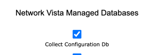
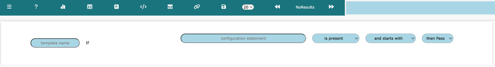
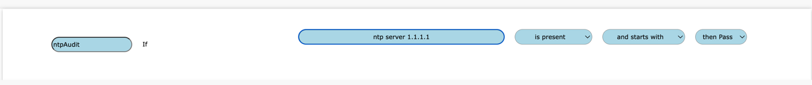
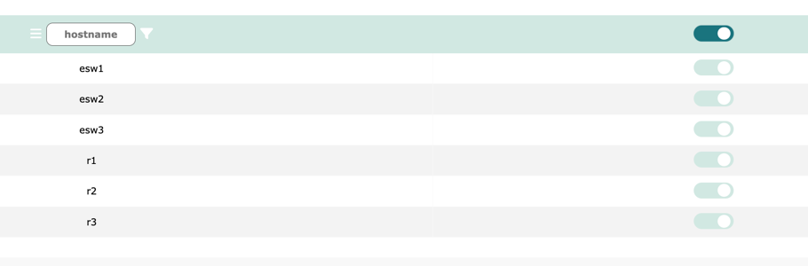
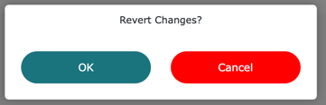
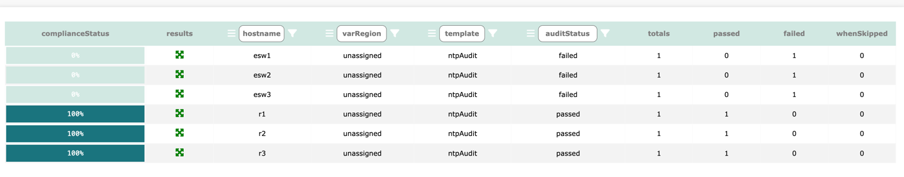
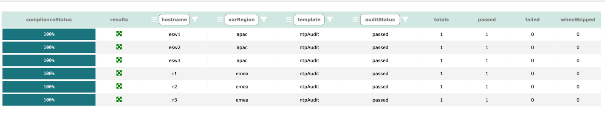

# Network Vista Compliance Audit

Log into Network Vista, open the menu (top left), select infra then Compliance Audit

<i>techTip: Some feature within the audit module are restricted root, admin and sudo admin users</i>

Before starting, please confirm that Network Vista is **Collect Configuration Db** enabled. 

Once confirmed and the Network Vista collection process has completed, following these steps

##### Menu Icons

 DashBoard Summary Page

 Table Results Page

 Device Level Results Page

 Input Device Variables

 Audit Template builder

 Template and Variable assignment

#### Audit Template builder

The Audit template build is where we create test templates which will be used to audit the configuration files.

In this example, I will be creating a test that will confirm that my NTP servers are set up correctly.

In this example, my template name is **ntpAudit**, and I am validating that **ntp server 1.1.1.1** is present across all devices. 

Once ready, click the save button 

Next, click on Template and Variable assignment 

Select the devices which should use this audit test template. In this example, all devices will be enabled.

<i>techTip: Click the filter button  in the column to enable or disable all items within the column,
then to disable the filter, click </i>

If needed, this table can reverted back to the last save, click ** restore ** 

Last step is to navigate to the Table Results Page  and push the start arrow button 

Results will be display once processing completes. 

Reading the result, 50% of the devices failed. This is due to these devices using a different NTP source **2.2.2.2**.
I could place another test under **ntpAudit** however, this would still result in a 50% failure. 

As expected

To resolve this, we must use regional vars. Regional Vars (or variables) are values which are swapped out depending on device locations. 

navigate to Input Device Variables 

Start by unlocking the table 

* varKey: a key (or name) which is used within the test audit template, **ntpOne**
* varRegion: the region in which the varKey resides, **emea**
* varValue: the value that will replace the varKey, **1.1.1.1**

To add another row, click . To remove a row, click  then the trash button on the row that needs to be removed 

Once ready, click  and Save . Nagiavte back to the Audit Template builder 

Remove the two existing tests by click the trash icon.

Instead of enter **ntp server 1.1.1.1**, this time I enter **ntp server {ntpOne}**. The top right information box will display errors. 

Click Save

Navigate back to the Template and Variable assignment . 

NOTE: Since I removed the two existing audit tests <i>before</i> I added the new regional var rule, all devices were unassigned. 
To maintain assessment, it is best to add <i>then</i> remove audit tests. 

* emea will contain: r1,r2 & r3
* apac will contain: esw1, esw2 & esw3
* all devices will be assigned to the ntpAudit template

<i>techTip: devices can only be assigned to one region at a time but can belong to one or more audit templates</i>

Navigate back to the Table Results Page  and restart the test.

everything is passing

Navigate back to the Device Level Results Page 

We can see that the keyVar has been replaced with the keyValue.

Another useful feature of the compliance audit tool is if/when condition:

* if: strict match, must be present
* when: test condition one, if matched, then test condition two and/or three (if used)

Whenever a **when** statement is used, the logic that Network Vista will apply is, if the condition is not met, skip conditions two and three (if provided).

This does not affect the overall audit score of a device.

In this example, any device which has OSPF enabled must log adjacency changes (log-adjacency-changes)

Navigate back to the Table Results Page  and restart the test.

Five Skips and One Pass, as expected

Click on the results icon  to see device level results 

#### Summary View

Navigate back to the DashBoard Summary Page 

<i>techTip: Each device summary ring is hyperlinked, click on the device to see a detail view of the audit results</i>

