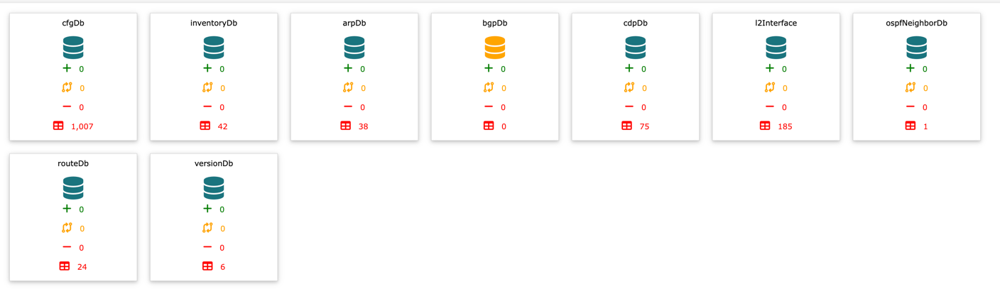
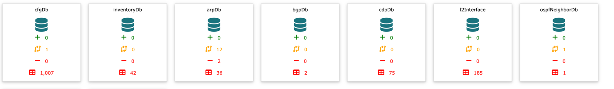
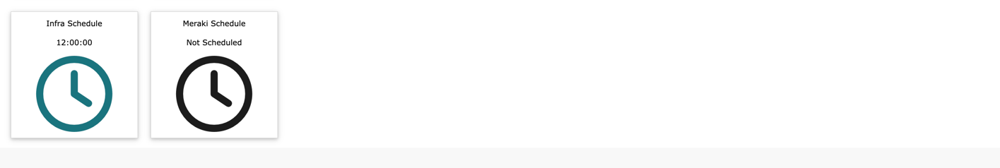
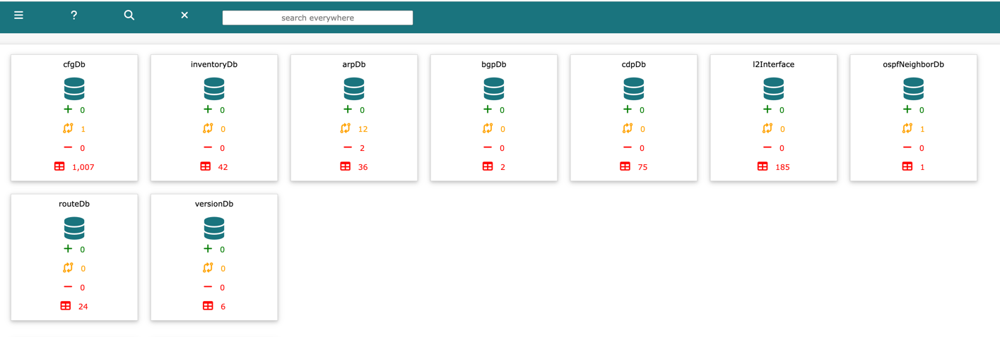
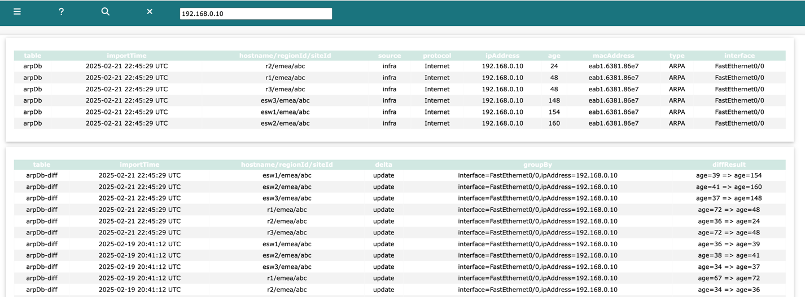

# Network Vista Dashboard

Each time a new DataBase table is create, a new panel will be displayed on the dashboard.

Panels are colour coded

* Green: Database operating normally
* Red: Database error
* Orange: No data present

Note: bgpDb is waiting for the collection process to start

*  diff additions, since the last scheduled collection or if scheduling is disabled, midnight UTC
*  diff updated, since the last scheduled collection or if scheduling is disabled, midnight UTC
*  diff deletes, since the last scheduled collection or if scheduling is disabled, midnight UTC
*  total number of rows present in table

<i>techTip: each panel is hyperlinked, click on the database to be redirected to the table</i>

#### Scheduling

The Scheduling panels display the next collection time. 

Embedded in the top navigation bar, there is a **search anywhere** input. Use this to perform a quick search across all databases. 

Once ready, click 

To close and return to the dashboard, click 

