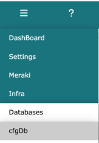
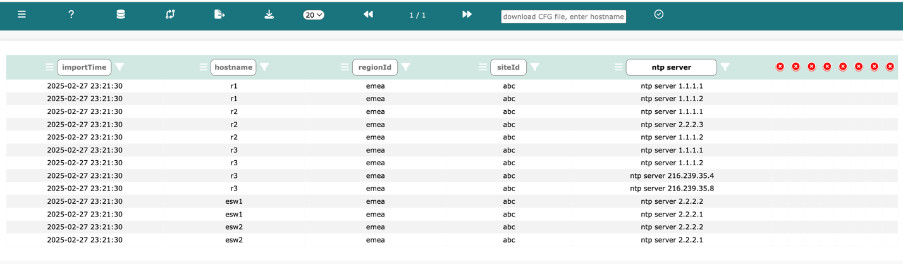
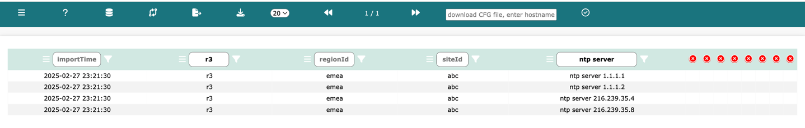
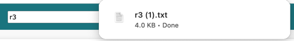
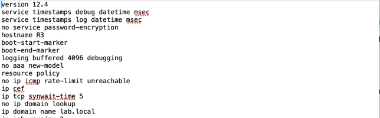
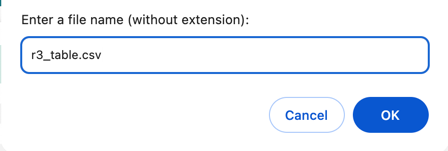
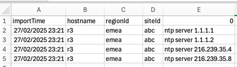
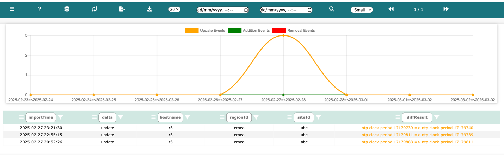
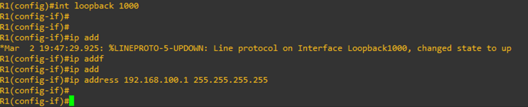
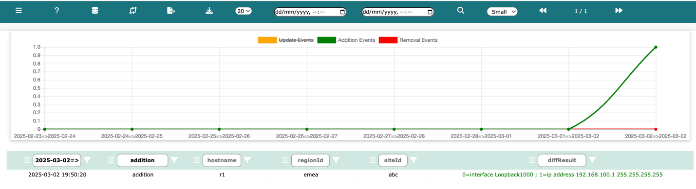

# Infra Configuration DB

Log into Network Vista, open the menu (top left), and select **infra** then **Databases** and **cfgDb**:

The infra configuration DB is similar to any other Network Vista database however, the input parser has been 
custom-built to preserve the tree like structure of a standard configuration file. Whenever a branch or branch of branch 
appears within the configuration file, Network Vista indents the output into the next column. This allows for better searching and slicing of data queries. 

<i>Note: any column that contains no output will be automatically closed</i>

Example, searching **ntp server** under column zero (the root column)

then refining the query to include only **r3**

#### Extracting the Configuration file

To download a copy of a device configuration file, enter the name of the device in the download field found in the main navigation bar

Click  and Network Vista will download a copy of the file

To download a copy of the viewable table, click 

#### Config Diffs

To access the **config diffs**, click , the past Seven days of Diffs will be displayed.

<i>Note: unlikely regular Network Vista Diff tables, it is not possible to select and group diff's. Diff changes are automatically assigned to groupBy values</i>

#### Diff's in action

Example, added new loopback interface

New Loopback interface displayed in **Green**

