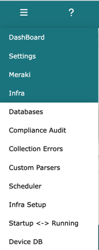
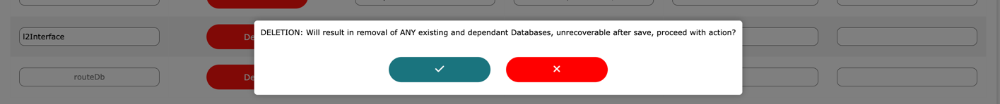
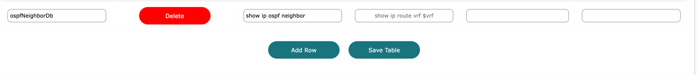

# Infra setup

<i>techTip: Infra Setup is only visible to **root**, **admin** and **sudo admin users**</i>

Log into Network Vista, open the menu (top left), select infra then **Infra Setup**

Use the Infra Setup module to enter show commands, which are then used to create the table databases. 
Each database requires a unique DB ID and can support up to four show commands. 
The show commands must be parsable using NTC parsers; otherwise, the database will not be created.

In this example, four databases have been created. Since the outputs of **show cdp** and **show lldp** are identical, they can be combined.

For Cisco IOS devices that use VRFs, use $vrf instead of the VRF name. Network Vista will automatically resolve all device VRFs. 

To add a row, click **'Add Row'**

* Table Names should be unique with no special characters.
* Enter at least one NTC supported show command or one custom PPT parser (see ppt_parser.md).

Once ready, click **'Save Table'**

To delete a Database, click **'Delete'**. This will remove the database and any dependant databases. 

Warning: this is unrecoverable once saved.

**Warning**: Changing the database ID after a database has been created will result in the removal of that 
database and any dependent databases.

<i>techTip: Changes to the Infra Setup table are committed after the **Save Table** has been clicked</i>

#### Example: Adding a new table Database

In this example, I am going to collecting ospf neighbor information from all OSPF enabled devices. 

Start by selecting the **Add Row** button. A new row will appear.

Next, name the database and add the show command to the first show command column

Click **Save Table**, the table will refresh after the save has completed

The table will be populated during the next collection cycle. 

Dashboard view now displays the new database, it will remain orange until it is popluated with data. 

After data import

