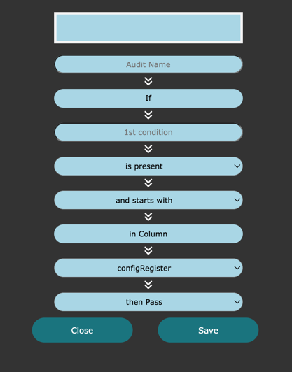
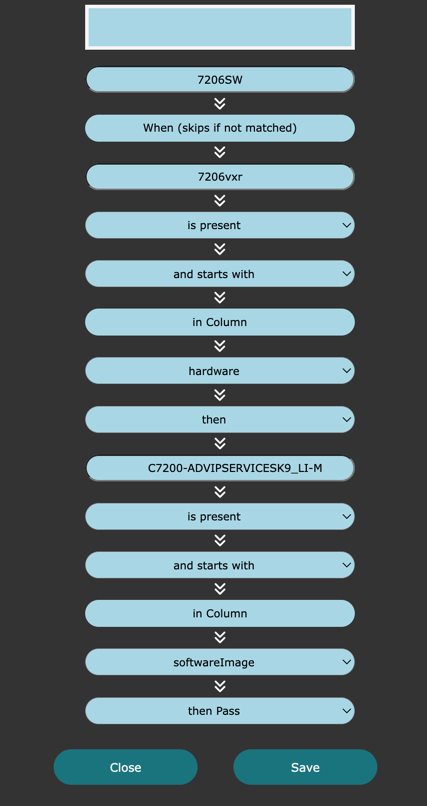
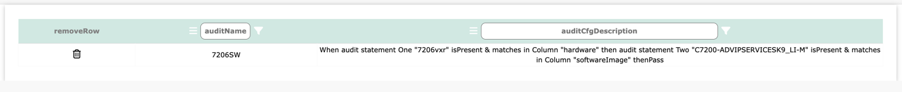
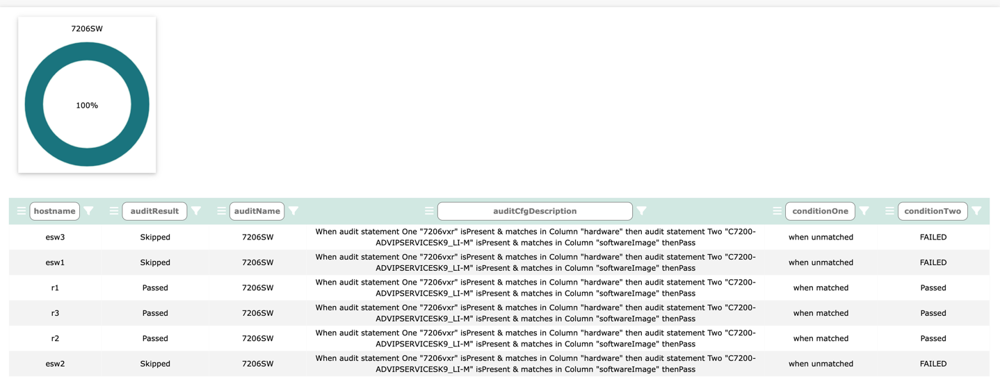

# Table Audits

Log into Network Vista, open the menu , select a database, then click 

The Table Audit feature allows users to create custom audit tests that run against the table. These tests can be used to validate data and state.
To create a table audit, click   

#### When(then) vs If

Since each audit template assesses all table rows, you may need to create a test that focuses on a specific set of devices.

For example, when writing a test to confirm that all 7206 devices are using a specific IOS version, using an If statement would result in a match but could fail when encountering other platform types.

To reduce false positives, consider using the When/Then option. If all values must be present, use the If statement.

#### Example: audit 7206vxr hardware is running on 	C7200-ADVIPSERVICESK9_LI-M

* enter an audit name: 7206SW
* add first condition to match: 7206vxr
* match: is present
* and starts with: and starts with
* columns: hardware
* <i>then</i>
* add second condition to match: C7200-ADVIPSERVICESK9_LI-M
* match: is present
* and starts with: and starts with
* columns: hardware

Click Save

To start the audit, click 

<i>TechTip: Audit process runs each time Network Vista runs a collection</i>

Click  to view the results

In the results, we see three skips and three matches. When the platform is 7206vxr then we expect software image to be C7200-ADVIPSERVICESK9_LI-M.
As the platform was not a 7206vxr, condition one did not match so condition two was skipped. Skipped results are excluded are the final audit assessment score. 

