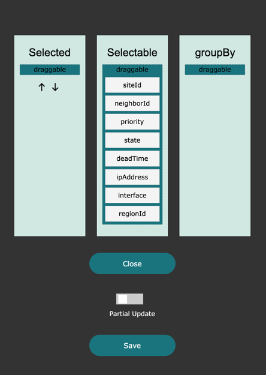
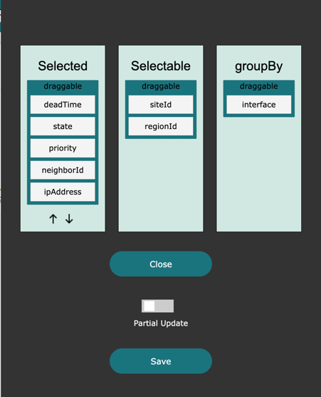
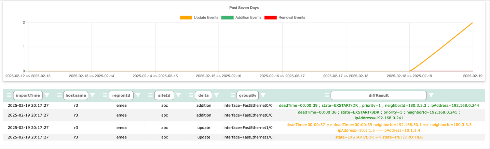
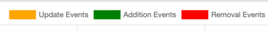
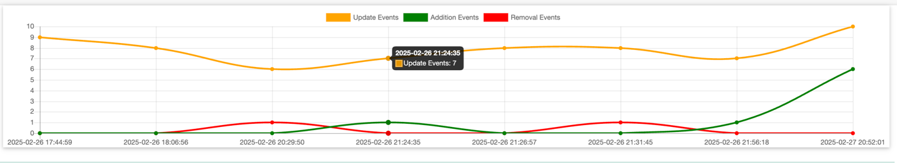
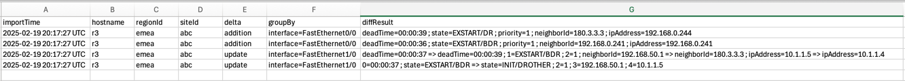
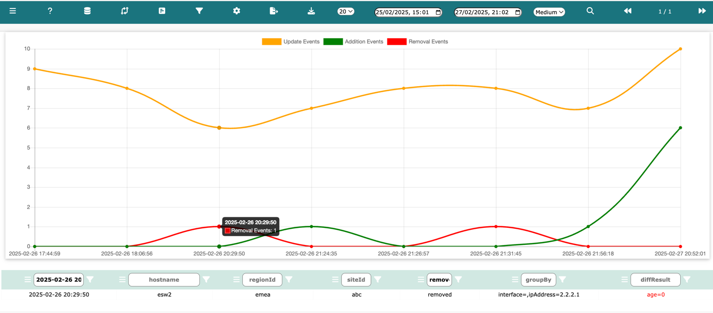

# Table Diffs

Log into Network Vista, open the menu , select a database, then click .

By default, when a table is first created, all diff processing is disabled. Follow these steps to enable diff processing

**Note: Columns will remain empty until first fetch of data.**

From the diff DB page, click 

Move the column names into either groupBy or Selected:

<i>techTip: groupBy must contain at least one column before the diff process can begin</i>

The groupBy column functions as a parent or a set of parents. Columns within Selected can be considered children of those parents.

For example, if Interface is present in Selectable, it could serve as a logical parent. If VRF is also present, then both Interface and VRF act as parents. 
Under Selected, these columns are used to detect changes.

In this example, deadTime, state, priority, ipAddress, and neighborId have all been selected.

* If a new OSPF peer forms within an existing parent, it is considered an update.
* If a new OSPF process is created on a device, it introduces new parents and is classified as an add.
* If an OSPF process is shut down, it results in a remove.

#### Partial Update vs Full Update

* Partial Update: Reruns the diff process against hosts that have appeared in the last update
* Full Update: Reruns the diff process using all hosts. 

Neither Partial Update nor Full Update will fetch any data from the network. Network Vista keeps two stored copies of the database.
If two copies of data are not available, either wait until the next schedule import or force import.

During the last fetch, we saw two updates and two addition. Within the diffResult column, we can see the before => after values.  

#### Resizing the table graph

Use the size selector found in the top navigate bar to resize the table. 

Select from one of the following:

* small (default)
* medium
* large

#### Interacting with the table graph

Once Network Vista collects enough table diff data, it will display your diffs as a table chart. Changes are displayed as either

* red line, item was removed
* orange line: update occurred
* green line: new item was detected

The **Update Event**, **Addition Event** and **Removal Event** buttons found at the top of the table are active. Click these buttons to customise your view. 

<i>Note: if no data ranges are applied, the default behavior is to display the last seven days in 24 hour blocks.</i>

While click each button, the corresponding line will either appear or disappear. 

Hover over any table intersections (where x mets y) and a tooltip will appear. The tooltip will display the total number of change events for that point in time.

Next, click on the intersection circle. The data table below will fetch rows that pertain to this intersection point. Simply click on any intersection point 
to see data. 

#### Saving data to your local system

Use the following buttons to save data to your local file system.

* To save a copy of the viewable table, click 
* To save a copy of the full database, click 

#### Time Range Search

To use the time range search feature, simply select a start date and an end date and click search.

Example: Display **removal events** for time stamp **2025-02-26 20:29:50**

To add further search refinements, simply add a value into a column and click filter (within any of the columns).

If two (or three) intersection points are merged into one, Network Vista will return all three.  

