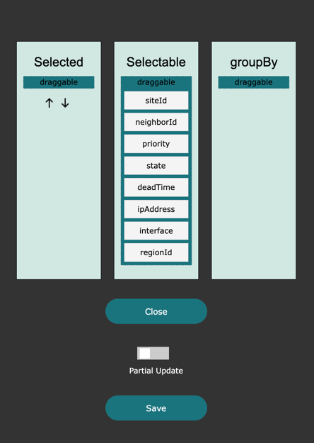
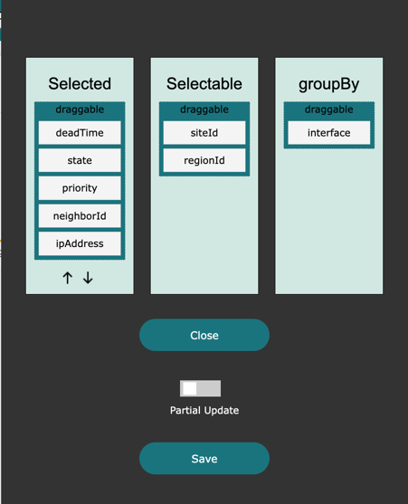
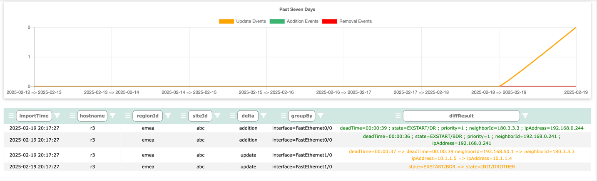
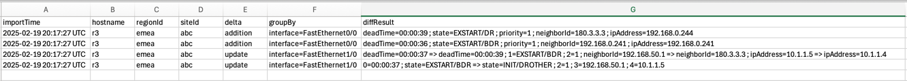
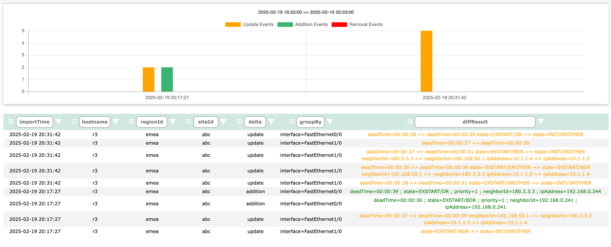

# Table Diffs

Log into Network Vista, open the menu , select a database, then click .

By default, when a table is first created, all diff processing is disabled. Follow these steps to enable diff processing

From the diff DB page, click 

Move the column names into either groupBy or Selected:

<i>techTip: groupBy must contain at least one column before the diff process can begin</i>
The groupBy column functions as a parent or a set of parents. Columns within Selected can be considered children of those parents.

For example, if Interface is present in Selectable, it could serve as a logical parent. If VRF is also present, then both Interface and VRF act as parents. 
Under Selected, these columns are used to detect changes.

In this example, deadTime, state, priority, ipAddress, and neighborId have all been selected.

* If a new OSPF peer forms within an existing parent, it is considered an update.
* If a new OSPF process is created on a device, it introduces new parents and is classified as an add.
* If an OSPF process is shut down, it results in a remove.

#### Partial Update vs Full Update

* Partial Update: Reruns the diff process against hosts that have appeared in the last update
* Full Update: Reruns the diff process using all hosts. 

Neither Partial Update nor Full Update will fetch any data from the network. Network Vista keeps two stored copies of the database.
If two copies of data are not available, either wait until the next schedule import or force import.

During the last fetch, we saw two updates and two addition. Within the diffResult column, we can see the before => after values.  

* To save a copy of the viewable table, click 
* To save a copy of the full database, click 

#### Time Range Search

To use the time range search feature, simply select a start date and an end date and click 

