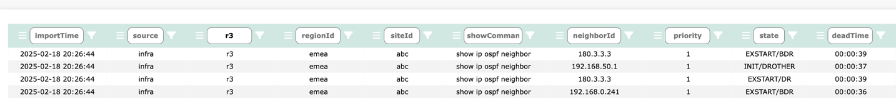
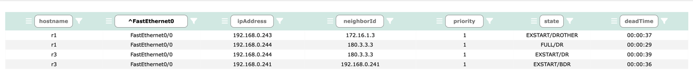
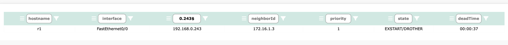
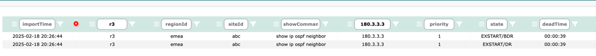
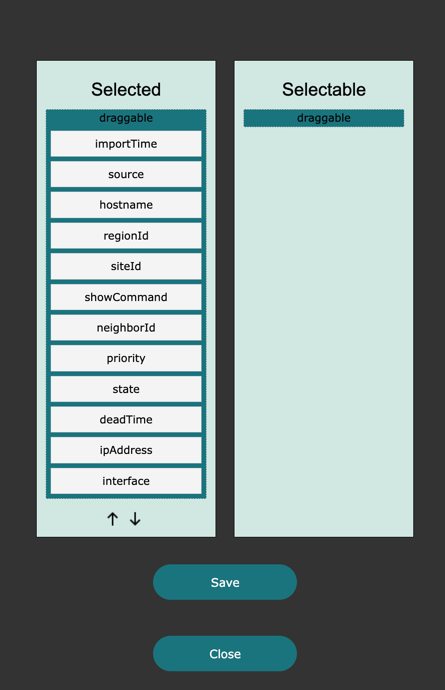
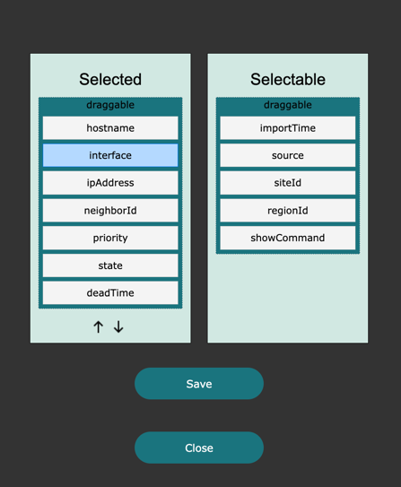
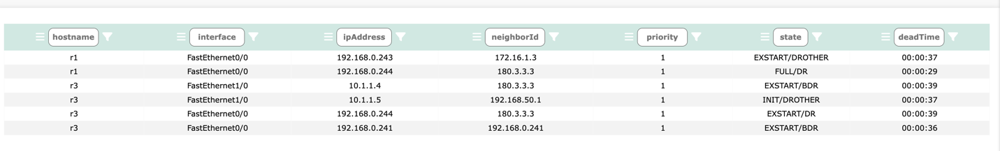

# Table Data

Once Network Vista has collected and structured the data, it is placed into tables and made available through the UI or API.
The number of displayed rows is 20, however, this can be adjusted by using the row selector. 

### Query

To query, simply enter a value which you are searching for. In this example, I am looking for all OSPF neigbors on host r3

Click the filter button  found on the right side of each column

To further refine a search, continue to add by filtering values in each of the column fields. I enter 180.3.3.3 and click the filter button.

By default, the standard query method uses a lookup of value "contains". Querying data is case-sensitive. 
To change the behaviour from value contains to either starts with or ends with, use the following regex characters:

* ^ for starts with
* $ for ends with

### Hiding columns
To temporarily hide a column, select the column menu button 
. The icon will display red when enabled, then select the  icon. 

The column will remain hidden until you leave the page.

Remove all filters to see the full table. 

click , the column will reappear.

### Changing column order & columns selection

By default, all table columns are displayed. For some tables, this could result in over 20 columns of data being displayed. 

To filter out unwanted columns, click on the top main menu filter button 

A table column selector page will be displayed

Simply move the column name from Selected -> Selectable to hide the column. 

Alternately, move columns from Selectable -> Selected to make visable again.

To change the order of the table, highlight the column name in the Selected column and use the arrows to adjsut the position

Once ready, click Save. The table will update then click Close. 

